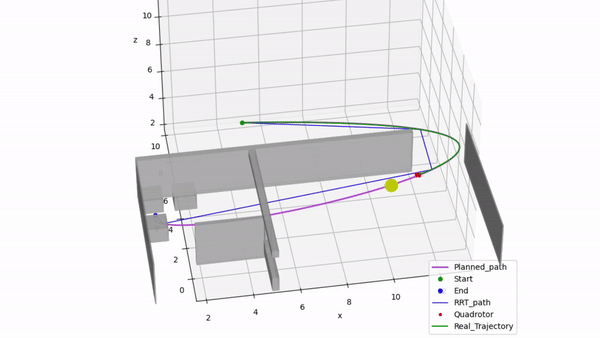

### Hi there 👋
### This is Frankie Yuezhe Zhang!

- 🔭 Welcome to my Github page! 
- 🌱 I am currently a MSc student in Robotics at [TU Delft](https://www.tudelft.nl/en/). Prior to that, I obtained my Bachelor's degree in Mechatronics Engineering (Xuteli School, with honours) at [Beijing Institute of Technology](https://english.bit.edu.cn/).
- 😄 I am interested in motion planning for mobile robots and robot arms and human robot interaction. Hope one day we can bring more robots to people's daily lives.
- 📫 Feel free to contact me if you want to discuss interesting topics about robotics.

### Recent Projects
<!--
#### Global Planning and Local Obstacle Avoidance for a Drone
The draft paper can be found [here](https://www.researchgate.net/publication/358573208_Planning_Algorithm_for_a_Quadrotor_Drone).

#### 3D Pedestrian Detection based on Multiple Sensors

-->

| [Global Planning and Local Obstacle Avoidance for a Drone](https://www.researchgate.net/publication/358573208_Planning_Algorithm_for_a_Quadrotor_Drone) | 3D Pedestrian Detection based on Multiple Sensors |
|---|---|
 |  |

<!--
**yuezhezhang/yuezhezhang** is a ✨ _special_ ✨ repository because its `README.md` (this file) appears on your GitHub profile.

Here are some ideas to get you started:

- 🔭 I’m currently working on ...
- 🌱 I’m currently learning ...
- 👯 I’m looking to collaborate on ...
- 🤔 I’m looking for help with ...
- 💬 Ask me about ...
- 📫 How to reach me: ...
- 😄 Pronouns: ...
- ⚡ Fun fact: ...
-->
